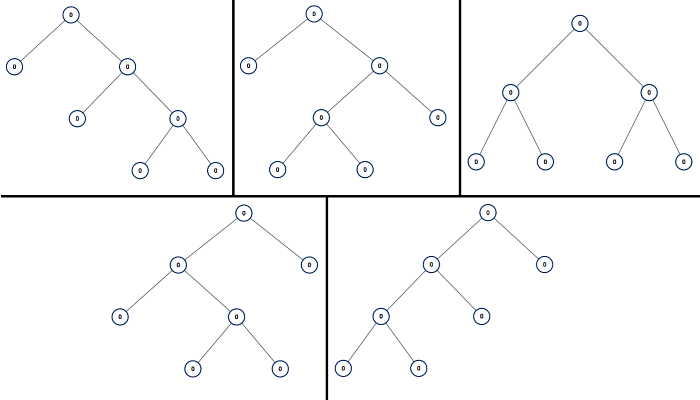

# All Possible Full Binary Trees

## Metadata

- Problem: 894
- Difficulty: Medium
- Source: https://leetcode.com/problems/all-possible-full-binary-trees/description/

## Problem Statement

Given an integer `n`, return *a list of all possible **full binary trees** with* `n` *nodes*. Each node of each tree in the answer must have `Node.val == 0`.

Each element of the answer is the root node of one possible tree. You may return the final list of trees in **any order**.

A **full binary tree** is a binary tree where each node has exactly `0` or `2` children.

**Example 1:**



```text
Input: n = 7
Output: [[0,0,0,null,null,0,0,null,null,0,0],[0,0,0,null,null,0,0,0,0],[0,0,0,0,0,0,0],[0,0,0,0,0,null,null,null,null,0,0],[0,0,0,0,0,null,null,0,0]]
```

**Example 2:**

```text
Input: n = 3
Output: [[0,0,0]]
```

**Constraints:**

- `1 <= n <= 20`
